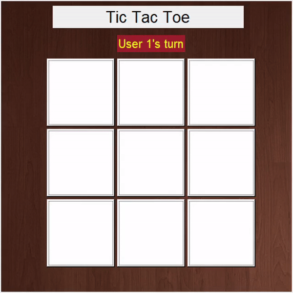

# tic_tac_toe
Tic tac toe game with well GUI. Built using python tkinter library.

## Contributing

Contributions are always welcome!

See [contributing.md](https://github.com/hitchhicker007/tic_tac_toe/blob/master/contributing.md) for ways to get started.

## System Requirements

:bulb: Before you begin, make sure you have the following installed:

- [Python](https://www.python.org/downloads/)
- [Git](https://git-scm.com/book/en/v2/Getting-Started-Installing-Git/)


## Steps

1. Clone the repository
```
git clone https://github.com/hitchhicker007/tic_tac_toe.git
```

2. Go to the root folder

```
cd tic_tac_toe
```

3. In the command prompt/ terminal run the following command

```
pip install -r requirements.txt
```

4. Run the following command to get started

```
python main.py
```

## Screenshot:
 -->

# tic-tac-toe 
https://github.com/hitchhicker007/tic_tac_toe is an open-source Tic-tac-toe game with GUI (graphical user interface) built using Python and tkinter library.

## Contributing

Contributions are always welcome!

See [contributing.md](https://github.com/hitchhicker007/tic_tac_toe/blob/master/contributing.md) for ways to get started.


## Description and Code walkthrough

The tic-tac-toe game is for two players. One player plays X and the other plays O. The players take turns placing their marks on a grid of three-by-three cells. If a given player gets three marks in a row horizontally, vertically, or diagonally, then that player wins the game. The game will be tied if no one gets three in a row by the time all the cells are marked.

1. When we select to play with a desktop a random selection is made by the computer using the random module in Python -
https://www.geeksforgeeks.org/python-random-module/

```
import random 
```

2. Next thing we need to import is the subprocess module -
Subprocess in Python is used to run new programs and scripts by spawning new processes. And it enables the user to launch new programs right from the current Python program thanks to the subprocess module. 

we have used the call method of subprocess - 
The Python subprocess call() function returns the executed code of the program. If there is no program output, the function will return the code that it executed successfully

```
import subprocess

subprocess.call(["python","main.py"])
```
3. Your goal with this project is to create a tic-tac-toe game in Python. For the game interface, you’ll use the Tkinter GUI tool kit
https://docs.python.org/3/library/tkinter.html

```
from tkinter import *
import from tkinter import ttk

```

4. We have also used the time module in python - as name suggests it allows us to work with the time
https://www.geeksforgeeks.org/python-time-module/

```
import time
```

5. So now we have all imports in place we can start with the logic to build tic-tac-toe. So first we need to make the structure of the game on the GUI how it will look basically we need a grid of 3x3 , this code is responsible for how the GUI is built - 

```
def center_window(w=300, h=200):
    # get screen width and height
    ws = root.winfo_screenwidth()
    hs = root.winfo_screenheight()
    # calculate position x, y
    x = (ws/2) - (w/2)    
    y = (hs/3) - (h/3)
    root.geometry('%dx%d+%d+%d' % (w, h, x, y))

user=1
plyrs = 1
LARGE_FONT= ("Verdana", 12)
NORM_FONT = ("Helvetica", 10)
SMALL_FONT = ("Helvetica", 8)
bord = [0,0,0,0,0,0,0,0,0]
positions = [[80,100],[200,100],[320,100],[80,220],[200,220],[320,220],[80,340],[200,340],[320,340]]
root = Tk()
center_window(500,500)
root.title("Tic Tac Toe")

```

6. Now we need a function that determines the winning logic for the game, for that we need to decide how the winner is determined -

-Select the first turn of the player randomly.
-Write an infinite loop that breaks when the game is over (either win or draw).
-Show the board to the user to select the spot for the next move.
-Ask the user to enter the row and column number.
-Update the spot with the respective player sign.
-Check whether the current player won the game or not.
-If the current player won the game, then print a winning message and break the infinite loop.
-Next, check whether the board is filled or not.
-If the board is filled, then print the draw message and break the infinite loop.
-Finally, show the user the final view of the board.

```
def winning_condition(user):
    for i in range(0,len(bord)):
        if((bord[0]==user and bord[1]==user and bord[2]==user) or (bord[0]==user and bord[3]==user and bord[6]==user) or (bord[2]==user and bord[5]==user and bord[8]==user)
            or (bord[6]==user and bord[7]==user and bord[8]==user) or (bord[3]==user and bord[4]==user and bord[5]==user) or (bord[1]==user and bord[4]==user and bord[7]==user)
            or (bord[0]==user and bord[4]==user and bord[8]==user) or (bord[2]==user and bord[4]==user and bord[6]==user)):
            winner_msg(user)
            Button(root,text="Exit",bg="#ff2e2e", width=8,font=("bold",20),fg="white",command="exit").place(x=270,y=240)
            Button(root,text="ReMatch",bg="#ff2e2e", width=8,font=("bold",20),fg="white",command=rematch).place(x=100,y=240)
            return 1
    return 0

    //this method shows the message of the result
    def winning_condition(user):
    for i in range(0,len(bord)):
        if((bord[0]==user and bord[1]==user and bord[2]==user) or (bord[0]==user and bord[3]==user and bord[6]==user) or (bord[2]==user and bord[5]==user and bord[8]==user)
            or (bord[6]==user and bord[7]==user and bord[8]==user) or (bord[3]==user and bord[4]==user and bord[5]==user) or (bord[1]==user and bord[4]==user and bord[7]==user)
            or (bord[0]==user and bord[4]==user and bord[8]==user) or (bord[2]==user and bord[4]==user and bord[6]==user)):
            winner_msg(user)
            Button(root,text="Exit",bg="#ff2e2e", width=8,font=("bold",20),fg="white",command="exit").place(x=270,y=240)
            Button(root,text="ReMatch",bg="#ff2e2e", width=8,font=("bold",20),fg="white",command=rematch).place(x=100,y=240)
            return 1
    return 0

```

## Features 
1. You can play this game with your partner or with the computer as single player.
2. you can see on the screen which player has won with a winning meesage.
3. There are two options - 1. have a rematch (the game will start again) 2.Quit the game.
4. You can choose between the cross and the circle symbol.


